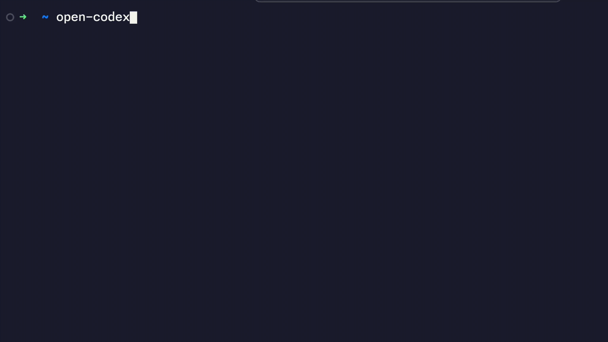

# OCODX — Open Codex Desktop

<div align="center">
  
  <h1 align="center">⬡ OCODX</h1>
  <p align="center">The Sovereign Liquid Matrix (SLM-v3) Desktop Interface</p>
  <p align="center">
    <a href="#-installation"><b>Get Started</b></a> •
    <a href="#-mcp-hub"><b>MCP Hub</b></a> •
    <a href="#-yoo-builder"><b>YOO Builder</b></a> •
    <a href="#-aionui-browser"><b>AionUI</b></a>
  </p>
</div>

---

**OCODX** is a premium, high-performance desktop evolution of the [Open Codex CLI](https://github.com/codingmoh/open-codex). It transforms the lightweight terminal assistant into a massive **Sovereign Liquid Matrix (SLM-v3)**—a professional-grade workbench for autonomous engineering, complex tool-calling, and visual layout surgery.

🧠 **Local Sovereignty** – Optimized for **Ollama**, **LM Studio**, and **Gemini**. Control every tool, every file, and every agentic role from a single, beautiful **Dark Mode** desktop UI.

---

## 🏗 The Desktop Advantage (OCODX)

Designed for deep flow and professional engineering, OCODX introduces a multi-panel environment:

### ⬡ Sovereign Liquid Matrix (SLM-v3)
Access **90+ specialized agentic roles** across 16 logic clusters. Each role (Architecture, DevSecOps, Cloud, etc.) is tuned for precision, allowing you to persist knowledge in a "liquid state" across sub-agentic operations.

### ⊕ MCP Hub (Model Context Protocol)
Orchestrate **50+ tools** from a single interface. The OCODX hub connects your AI directly to your workspace:
- **Filesystem & Shell**: Safe, confirmed execution.
- **Git & SQLite**: Automated commits and data surgery.
- **Joomla & YOOtheme**: Expert CMS management tools.

### 🌐 AionUI Browser (AI on UI)
A headed autonomous browser agent that performs live web research and automation while you watch. AionUI brings "AI on UI" to life, navigating complex web interfaces to gather documentation and perform tasks.

### 🏗 YOO Builder
AI-native visual layout generation for **YOOtheme Pro**.
- **NL → Layout**: Describe a layout in natural language.
- **Visual Palette**: One-click injection of Hero, Features, CTA, and Testimonial presets.
- **Direct Injection**: Push layouts directly into your CMS with live JSON surgery.

---

## ✨ Core Features

- **Hybrid Orchestration**: Seamlessly switch between Local (Ollama/LM Studio) and Cloud (Gemini/Ollama Cloud) providers.
- **Visual Terminal**: Real-time streaming of shell commands and file changes with one-click approval.
- **Desktop Integration**: Use the `manage.sh` tool to create a native macOS `.app` bundle with a custom OCODX icon.
- **Security First**: Every action—from writing a file to pushing a commit—requires your explicit confirmation in the UI.

---

## 📦 Installation

OCODX uses a self-healing management script to handle dependencies and environment setup.

### 🔹 Step 1: Clone & Initialize
```bash
git clone https://github.com/Ig0tU/ocodx.git
cd ocodx
```

### 🔹 Step 2: Run Diagnostics
Check your Node, Python (UV), and LLM environments:
```bash
./manage.sh doctor
```

### 🔹 Step 3: Launch the Stack
Install dependencies and start the app:
```bash
./manage.sh run
```

### 🔹 Step 4: Create Desktop Icon (macOS)
```bash
./manage.sh desktop
```

---

## 🐳 Docker Deployment

For a clean, containerized experience, OCODX can be deployed using Docker.

### 1. Configure your environment
Copy the example environment file and fill in your AI provider keys:
```bash
cp .env.example .env
```

### 2. Launch the Matrix
```bash
docker-compose up -d --build
```

OCODX will be available at `http://localhost:8000`. All your projects, threads, and matrix states will be persisted in the `ocodx_data` volume.

---

## 🛡️ Security Notice

All actions are executed **only after your explicit confirmation** in the OCODX UI. No data is sent to the cloud unless you explicitly use a cloud-based provider (Gemini/Ollama Cloud).

---

## 🧑‍💻 Lineage & Credits

OCODX is a specialized, feature-heavy expansion of [Open Codex](https://github.com/codingmoh/open-codex).

❤️ Built for the Sovereign Developer by [Ig0tU](https://github.com/Ig0tU), inspired by the work of [codingmoh](https://github.com/codingmoh).
